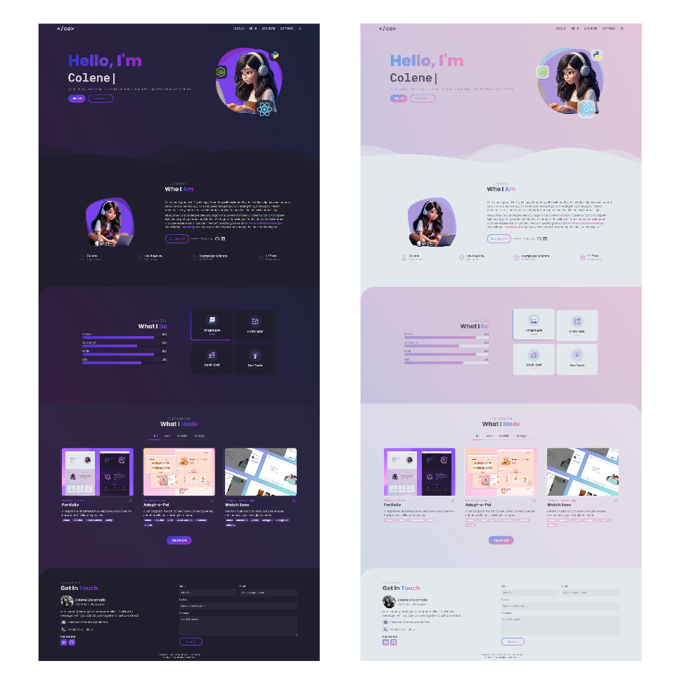

# Portfolio Website
    

---
A responsive and interactive website built with React (Vite), Tailwind, and Framer Motion to showcase my background, skills, and projects. Includes a dark and light mode theme and a contact form built with Netlify Forms.

